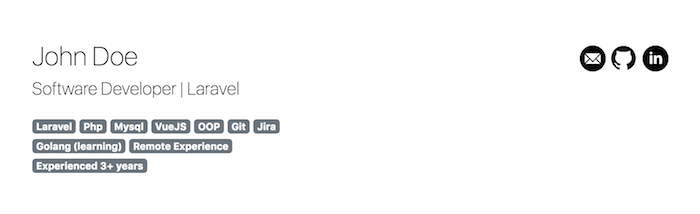

# Developer/Designer Website & Blog 

Developer webpage &amp; blog. Front and Admin Panel. Built with Laravel 5.6 and Vue2

## How to install

```
git clone https://github.com/ylnn/developer-web-admin-panel
```

Copy **.env.example** file to **.env**

Then update database settings in **.env** file.
```
composer install
php artisan migrate 
php artisan db:seed (if you want dummy data)
```

## Admin User:
```
email: admin@demo.com
password: demo
```

# Screenshots (front)



# Screenshots (admin)

